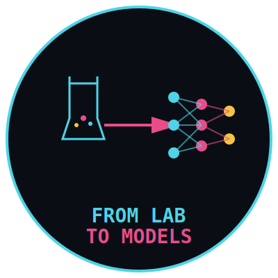

# From Lab to Models 

  

<strong>A Medical Scientist's Journey into AI/ML Engineering</strong>

---

##  About

**From Lab to Models** is a comprehensive blog documenting my transition from 10+ years as a medical scientist to becoming an AI/ML engineer. This site features:

-  **Complete AI/ML History**: Every major model from 1957 (Perceptron) to 2024 (Claude 4, GPT-4o)
-  **Personal Journey**: My experiences bridging medical science and artificial intelligence
-  **Real Projects**: Fall detection, choking detection, patient care systems, and more
-  **Data Storytelling**: How I transform healthcare data into actionable insights
-  **AI News**: Auto-aggregated latest developments from top AI labs

---

##  Mission

After witnessing the shortcomings in healthcare for over a decade, I decided to solve these problems using AI/ML. This blog shares:

- How medical rigour applies to AI engineering
- Building solutions that actually help people
- Career transition insights for others making similar moves
- Honest experiences - the wins, failures, and lessons learned

---

##  Tech Stack

- **Frontend**: Pure HTML5, CSS3, JavaScript (no frameworks needed!)
- **Styling**: Custom CSS with beautiful animations and hover effects
- **Features**: 
  - Responsive design with burger menu
  - Scroll-triggered animations
  - Interactive comment system (localStorage)
  - Auto-updating AI news via RSS feeds

  ---
  
##  Features

###  79 AI/ML Models Documented
From the earliest neural networks to the latest foundation models:
- Perceptron (1957) to Claude 4 (2024)
- Complete descriptions with context
- Historical significance and impact
- Tagged by category (LLM, Computer Vision, NLP, etc.)

###  Beautiful UI/UX
- Cyberpunk-inspired dark theme
- Smooth scroll animations
- Hover effects on model cards
- Mobile-responsive design
- Burger menu for mobile navigation

---

##  Live Site

Visit: **[from-lab-to-ai.vercel.app](https://from-lab-to-ai.vercel.app)**

---

##  Contributing

This is a personal blog, but I welcome:
- Bug reports
- Suggestions for additional AI/ML models to cover
- Feedback on the content or design
- Questions about my journey or projects

Feel free to open an issue or leave a comment on the site!

 ---
##  Connect

- **Blog**: [from-lab-to-ai.vercel.app](https://from-lab-to-ai.vercel.app)
- **LinkedIn**: [www.linkedin.com/in/zahra-etebari]
- **GitHub**: [@YOUR_USERNAME](https://github.com/Zahra58)

---
##  Background

**10+ years** in medical laboratories across:
- Public health facilities
- Private diagnostic labs  
- Research institutions
- Multiple laboratory sections

Now building AI/ML solutions for:
- Healthcare monitoring systems
- Fall detection for elderly care
- Choking detection for child safety
- Patient care optimization
- Data pipelines and analytics

---

##  License

MIT License 

---

##  Acknowledgments

Built with love, coffee and passion for solving real healthcare problems through AI/ML.

Special thanks to the AI research community for making these incredible models possible.

---

**⭐ If you find this useful, please star the repo!**

Made with 💙 and coffee by a medical scientist turned to AI/ML engineer
